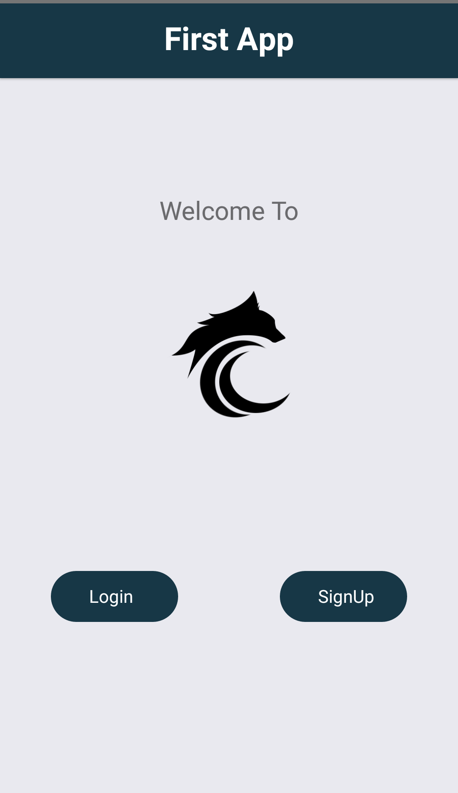
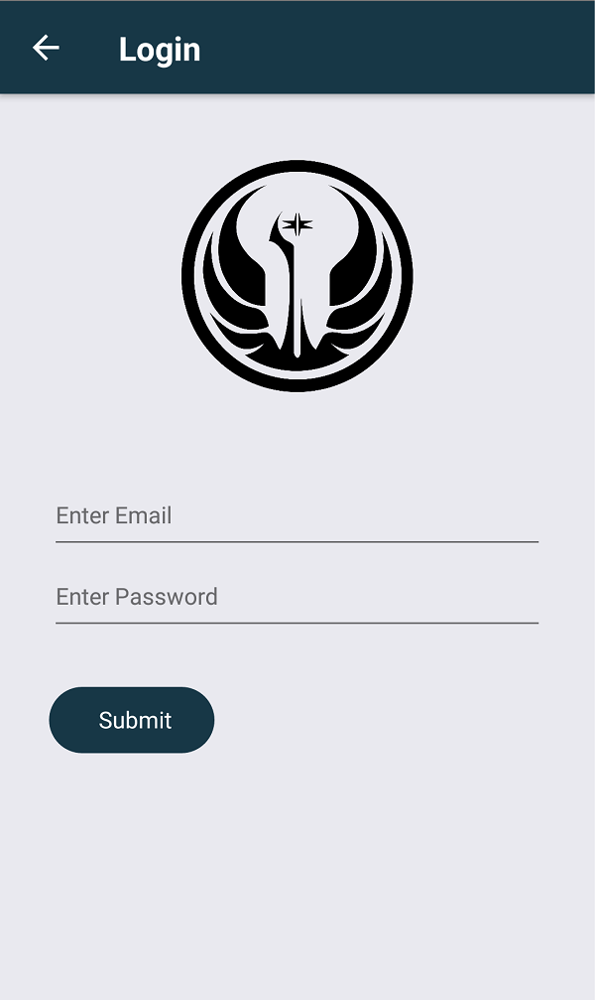

# Login and Signup using React-Native
It is a simple app where you can signup and login and connect this app via backend.
There is a file Api.js where you will have to change the address and port number accordingly.

## Screen 1

## Screen 2

## Screen 3

